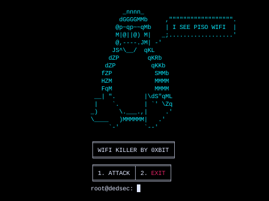

<h1 align="center"> DEDSEC WIFI KILLER </h1>

 Disconnect all WiFi clients with dedsec tool, you can easily disconnect all WiFi clients from a network and hide your MAC address to stay anonymous. 

### DESCRIPTION
DEDSEC WIFI KILLER is a linux-based tool tailored for network security, specifically designed to disconnect all WiFi clients discreetly. This tool ensures anonymity by concealing the user's MAC address during operations. With a user-friendly interface, DedSec empowers users to navigate and execute actions with precision, making it a versatile choice for ethical hacking, network testing, and privacy protection. It's essential to use DedSec responsibly, adhering to legal and ethical standards in all applications.

<h1 align="center"> SCREENSHOTS </h1>

### INSTALLATION
    * git clone https://github.com/0xbitx/Dedsec-Wifi-Killer.git
    * cd Dedsec-Wifi-Killer
    * chmod +x dedsec-wifi-killer
    * sudo ./dedsec-wifi-killer

### TESTED ON FOLLOWING:
* Kali Linux
* Parrot OS

### PREREQUISITES
* sudo - [ MUST ]

## Support

If you find my work helpful and want to support me, consider making a donation. Your contribution will help me continue working on open-source projects.

**Bitcoin Address: `36ALguYpTgFF3RztL4h2uFb3cRMzQALAcm`**

<h1 align="center"> DISCLAIMER </h1>

<h4 align="center">I'm not responsible for anything you do with this program, so please only use it for good and educational purposes. </h4>
