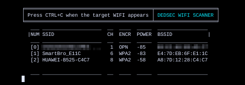
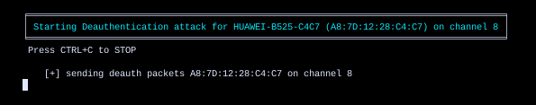

<h1 align="center"> DEDSEC WIFI KILLER </h1>

 Disconnect all WiFi clients with dedsec tool, you can easily disconnect all WiFi clients from a network and hide your MAC address to stay anonymous. 

<h1 align="center"> SCREENSHOTS </h1>

### INSTALLATION
* git clone https://github.com/0xbitx/Dedsec-Wifi-Killer.git
* cd Dedsec-Wifi-Killer
* chmod +x dedsec-wifi-killer
* sudo ./dedsec-wifi-killer

### TESTED ON FOLLOWING:
* Kali Linux
* Parrot OS

### PREREQUISITES
* sudo - [ MUST ]

### LANGUAGE 
* python

<h1 align="center"> DISCLAIMER </h1>

<h4 align="center">I'm not responsible for anything you do with this program, so please only use it for good and educational purposes. </h4>
